# 通信的基本概念与归类

> 按照不同的分类维度，通信方式可以分为以下几类：

- []通讯分类
- []单端与差分
- []串行与并行
- []同步与异步
- []双工与单工
- []USART/UART

- **本文目标**：对各种常见的通信方式进行分类，并给出对比与其适用场景，通过本文能初步建立起通信的基本理解。

---

## 目录

[[toc]]

---

## 1. 按数据传输方式
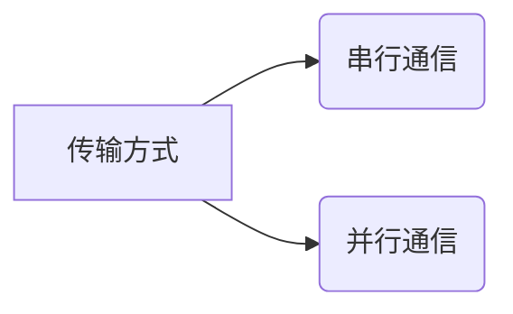
```mermaid
graph LR
A[传输方式]  --> B(串行通信)
A --> C(并行通信)
```
> 💡 **通俗理解**
> - **串行通信**：一字一字慢慢说（车道少，省钱但慢）。
> - **并行通信**：一句一句快点说（车道多，快但费钱）。

## 2. 按数据同步方式
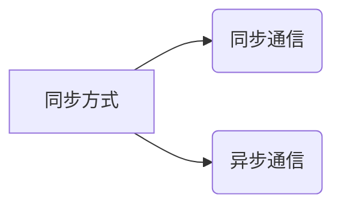
```mermaid
graph LR
A[同步方式]  --> B(同步通信)
A --> C(异步通信)
```
> 💡 **通俗理解**
> - **同步通信**：大家在一个屋子，看着同一个钟表，畅所欲言。
> - **异步通信**：大家在不同的屋子，各看各的表，发消息时要带上“开始”和“结束”的标记。

## 3. 按通信方向
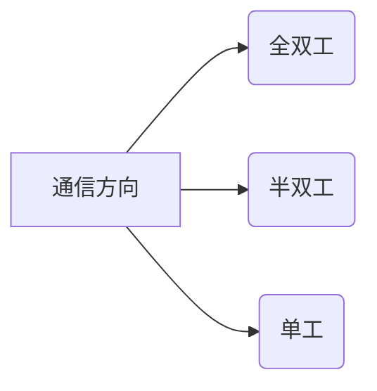
```mermaid
graph LR
A[通信方向]  --> B(全双工)
A --> C(半双工)
A --> D(单工)
```
> 💡 **通俗理解**
> - **全双工**：打电话（大家可以一起说）。
> - **半双工**：对讲机（我说完，你再说）。
> - **单工**：广播/红外遥控（只能我听你说，或者你听我说）。

---

## 4. 单端信号 vs 差分信号

**单端信号**：
- 特征
 - 由一个==参考端==（通常为地端 GND）和一个==信号端==构成。
 - 信号的高低电平是对 GND 的电压差。
 - 通信双方需要**共地**。
 - 大部分低频信号（如 TTL、RS-232）使用单端信号。

- 缺点
 - **抗干扰能力弱**：如果两点之间的地电位不一致（由电流引起的==电压降== ΔV = I × R 导致），会直接影响信号判断。
 - 地电势差受==布局结构、距离==等因素影响较大。

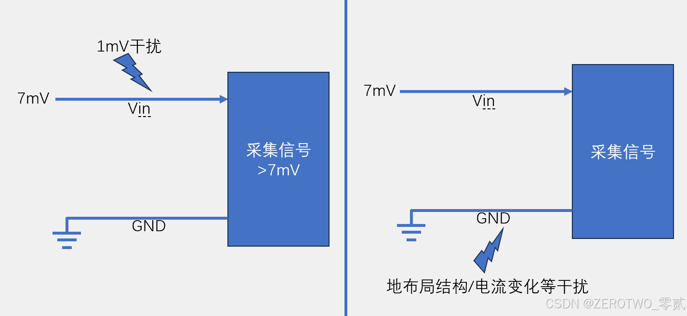

**差分信号**：
- 特征
 - 使用两条线（常标记为 P/N 或 +/-）共同传输一个信号。
 - 两根线上的信号**振幅相等、相位相反**。
 - 有效信息是==两根线之间的电压差==，不依赖地（GND）作为参考。
 - **抗干扰强**：外部噪声通常同时作用于两根线（共模干扰），接收端做减法计算时可以抵消干扰。

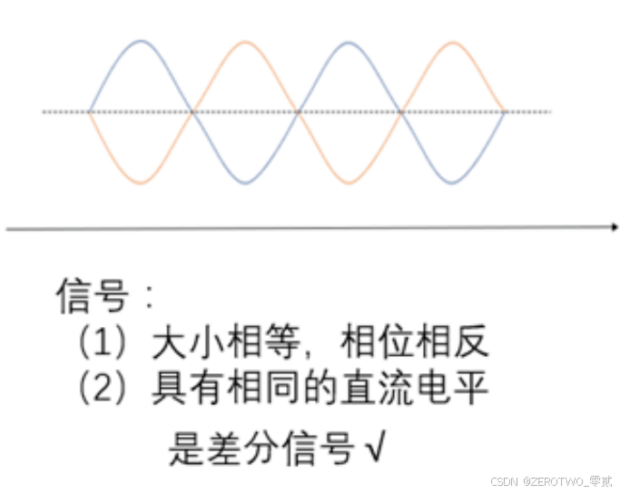

 - 常见于高频信号（如 USB、HDMI、CAN、RS-485）。
 - **PCB 设计要点**：差分线需要**等长、紧密靠近**（差分对）。
 > ~~打一圈过孔模拟法拉第笼效果~~ （注：确实常在差分线周围打地过孔以屏蔽干扰）

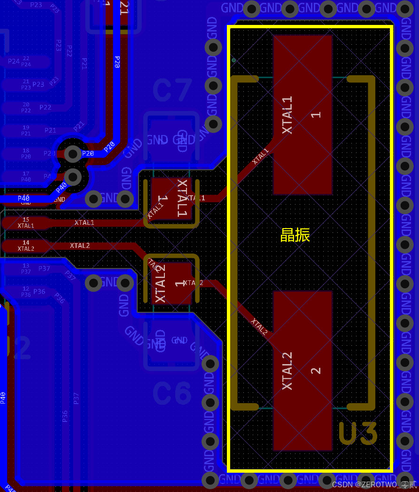

---

## 5. 串行通信
- 特征
设备之间通过==少量数据信号线==（一般 < 8根）、==地线 GND==、==控制信号线==，按位（Bit）形式**一位一位地依次**传输数据。
~~形同单车道~~

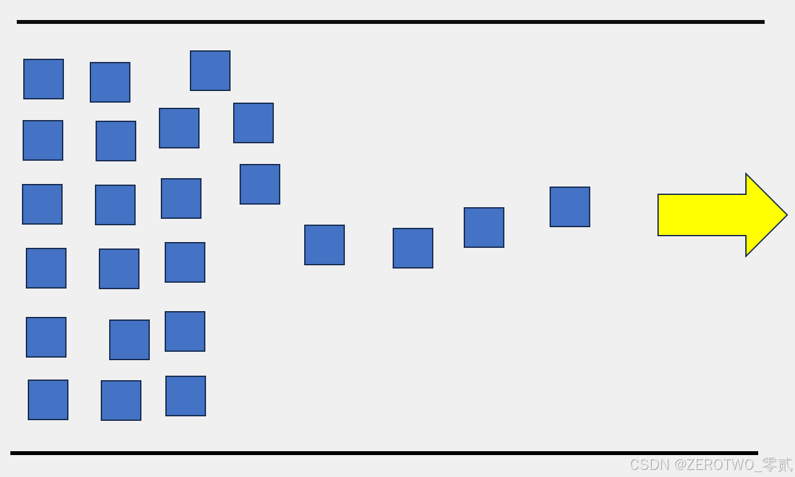

- 特点
 1. 线路少，==成本低==。
 2. 适用于==远距离传输==。
 3. 差分串行协议具有极强的==抗干扰性能==。
 4. ==支持多种标准协议==：RS-232, RS-485, SPI, I²C, USB 等。

## 并行通信
- 特征
使用 8、16、32、64 根或==更多数据线==，以字或字节为单位，一次性传输多个位。

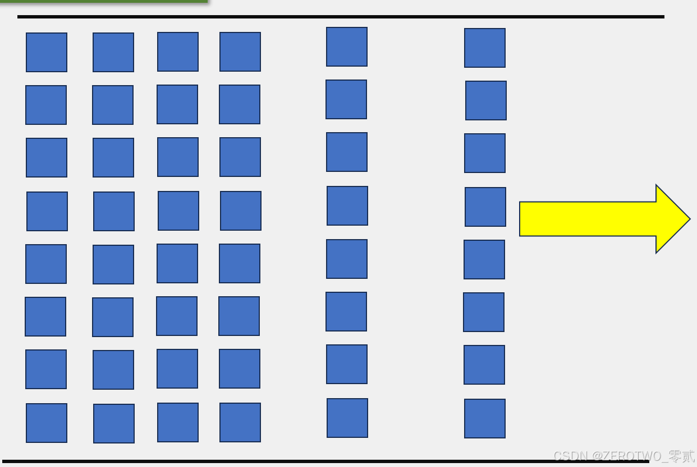

- 特点
 1. 适用于==高速==、==短距离==通信（如 CPU 内部总线、内存接口）。
 2. ==低延迟==，适合即时性要求高的场景。
 3. 成本高，线缆复杂，且存在线间串扰问题。

## 对比总结
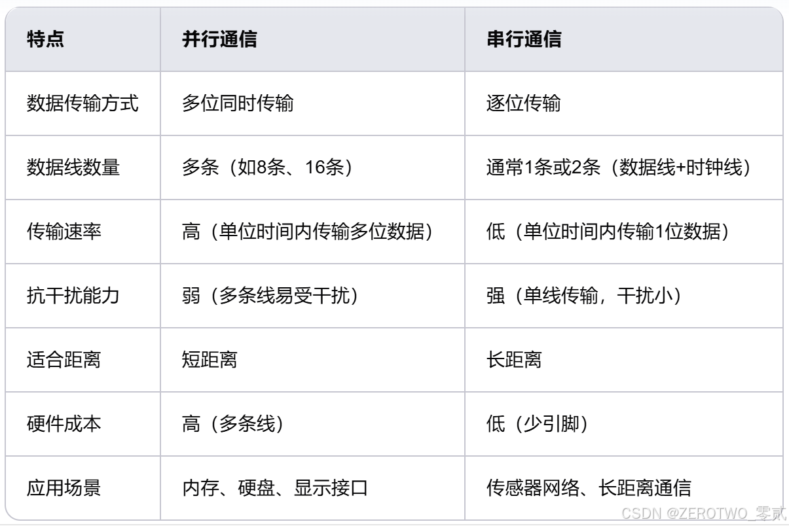

---

## 6. 同步通信
**代表协议**：I2C, SPI
- 特征
 - 包含 **CLK (Clock)** 专用==时钟信号线==。
 - 双方在同一个时钟信号的控制下，严格按照约定的时序进行传输。
 - 收发双方时钟完全同步，数据被认为是==实时==的。

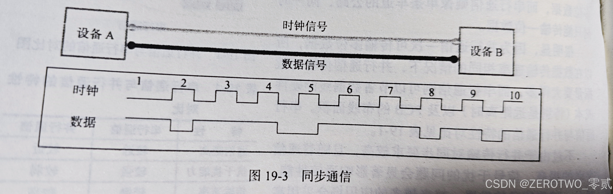

- 特点
 1. 效率高，适合大量数据传输。
 2. 结构相对复杂（需要额外的时钟线）。
 3. 通常是**阻塞模式**：发送方通常需要等待响应或特定的时钟周期。

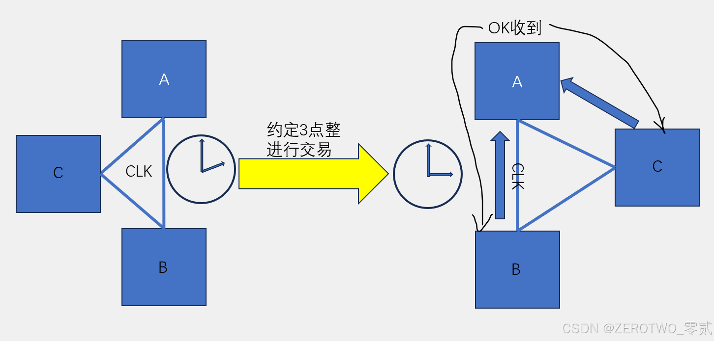

## 异步通信 
**代表协议**：UART/USART, CAN
- 特征
 - **不包含 CLK 时钟线**，收发双方各自使用自己的时钟。
 - 必须约定共同的==波特率==（Baud Rate）。
 - 依靠数据帧中的==起始位==、==停止位==来同步数据。
 ~~有点像使用无线电台 Over~~

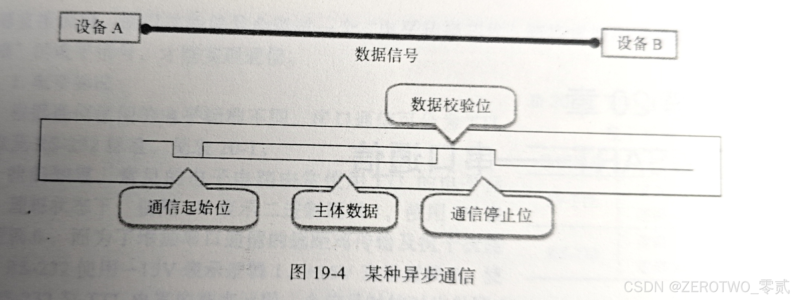

- 特点
 1. 灵活简单，不需要额外的时钟线。
 2. 抗干扰能力稍弱，对时钟精度有一定要求（收发双方时钟偏差不能太大）。
 3. 通常是**非阻塞模式**：发送方发完数据即可处理其他事务，不需要死等接收方响应。

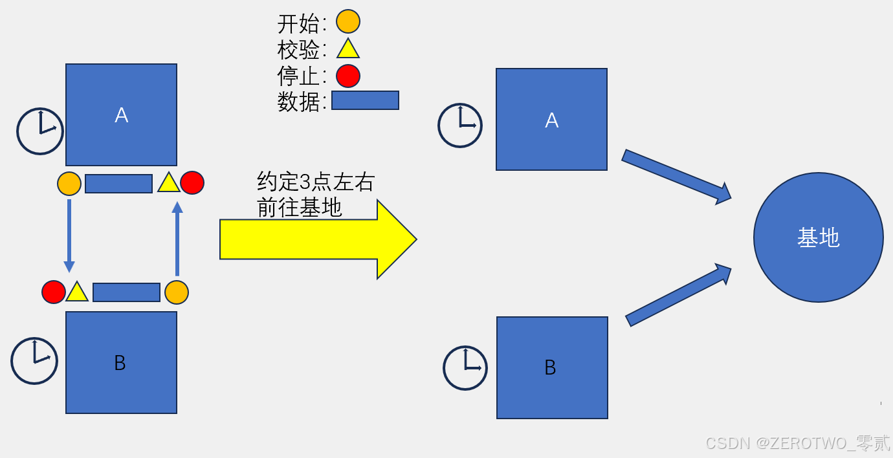

## 对比总结
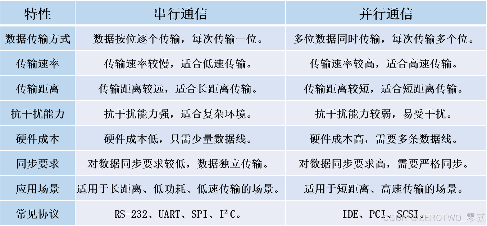

---

## 8. 全双工 vs 半双工 vs 单工

**全双工 (Full Duplex)**
**代表**：UART, SPI, 电话
 - 有两条独立的通道（TX/RX），可以==同时双向==传输。
 - ==效率最高==，无冲突。
 
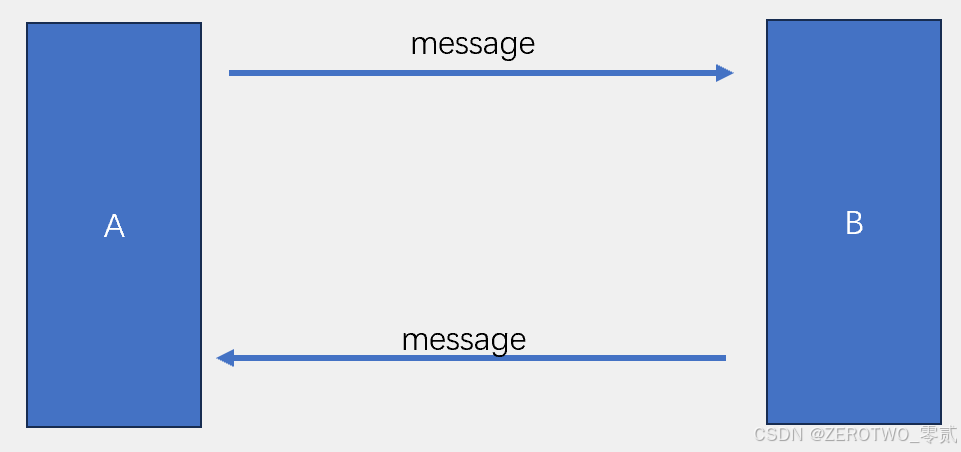

**半双工 (Half Duplex)**
**代表**：I2C, RS-485, CAN, 对讲机
 - 共用一条信道（或差分对），同一时刻只能有一个方向传输。
 - 需要协议层（如 CSMA/CD 或 主从应答）来避免冲突。
 - 特点：资源利用率高，==成本较低==。
 
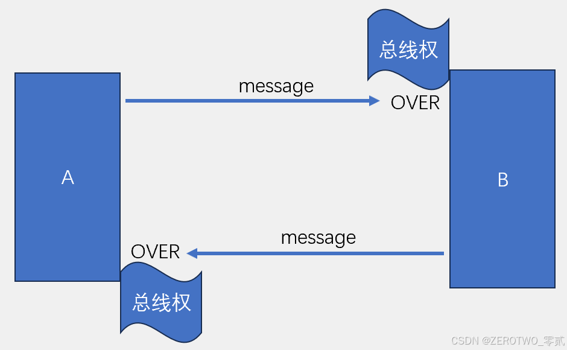

**单工 (Simplex)**
**代表**：广播, 红外遥控
 - 只能==单方向==通信，发送方固定，接收方固定。
 
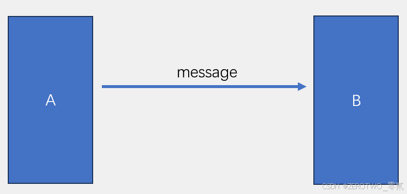

## 对比总结
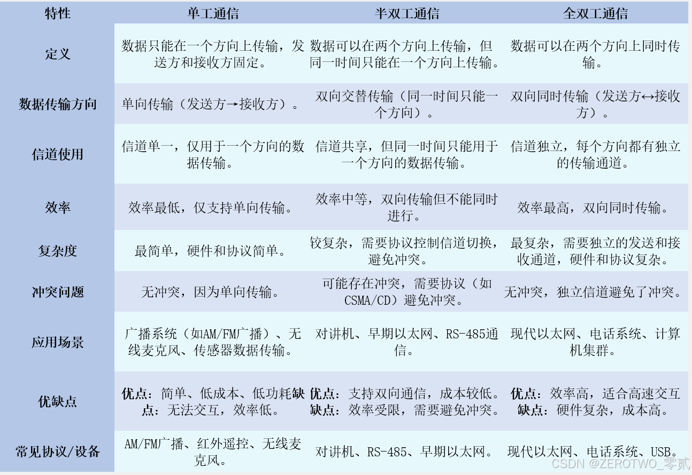

---

## 9. USART/UART 串口通信

- 协议分层框架
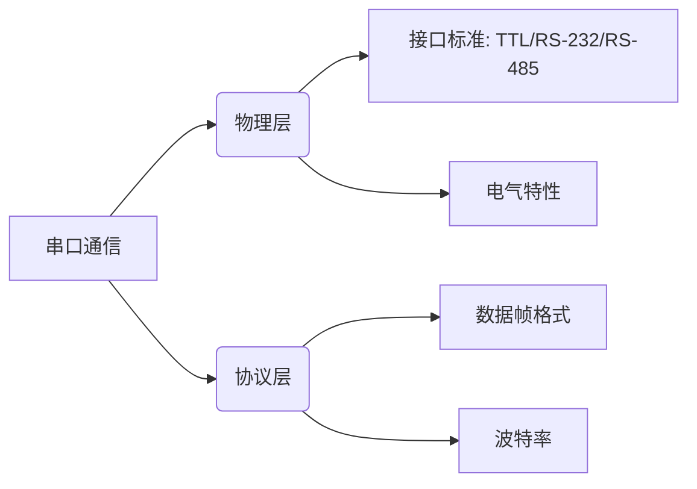
```mermaid
graph LR
A[串口通信]
A --> B(物理层)
A --> C(协议层)
B --> D[接口标准: TTL/RS-232/RS-485]
B --> E[电气特性]
C --> F[数据帧格式]
C --> G[波特率]
```

- 1. 接口介绍
  - **Universal Asynchronous Receiver/Transmitter (UART)**: 通用异步收发器。
  - **Universal Synchronous/Asynchronous Receiver/Transmitter (USART)**: 通用同步/异步收发器（UART 的增强版）。

- 常见引脚
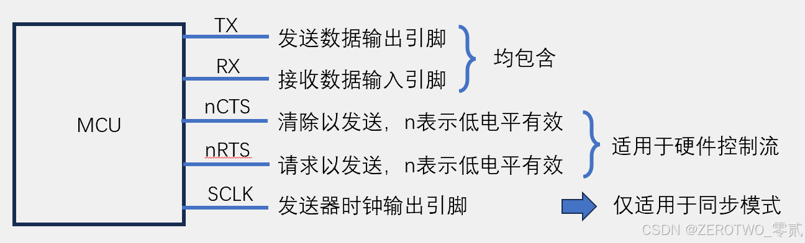
  - **TX** (Transmit): 发送端。
  - **RX** (Receive): 接收端。
  - **GND**: 地线（单端信号必须共地）。

- 软/硬件流控制 (Flow Control)
为了防止接收方缓冲区溢出（“爆仓”），需要流控制机制。

- 软件流控制
  - 不占用额外引脚。
  - 插入特殊字符：**XOFF** (0x13, 暂停发送) / **XON** (0x11, 继续发送)。
  - 缺点：数据中如果本身包含这些字符，需要转义，处理复杂。

- 硬件流控制 (RTS/CTS)
使用额外的引脚来控制数据流。
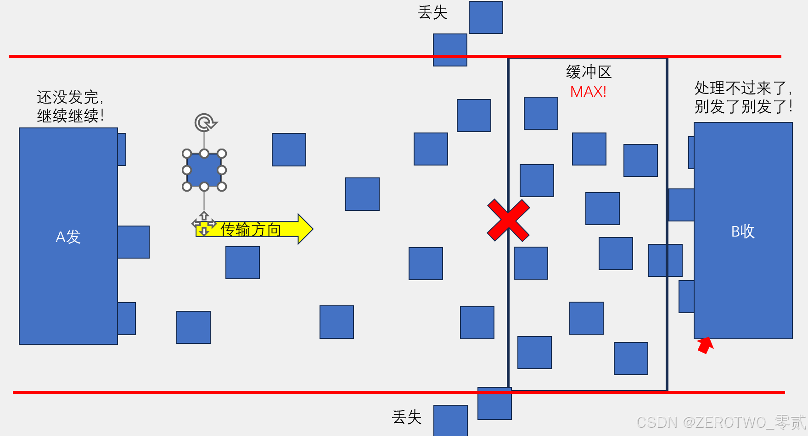

主要引脚（以 MCU 角度为例）：
  - **RTS (Request To Send)**: **输出**。 MCU 告诉对方“我准备好接收了”（通常**低电平有效**）。如果是高电平，表示“我忙，别发”。
  - **CTS (Clear To Send)**: **输入**。 MCU 检测对方“是否允许我发送”。如果是低电平，说明对方准备好了，MCU 可以发送数据。

> **连接方式**：一般是交叉连接，即 A 的 RTS 接 B 的 CTS，A 的 CTS 接 B 的 RTS。

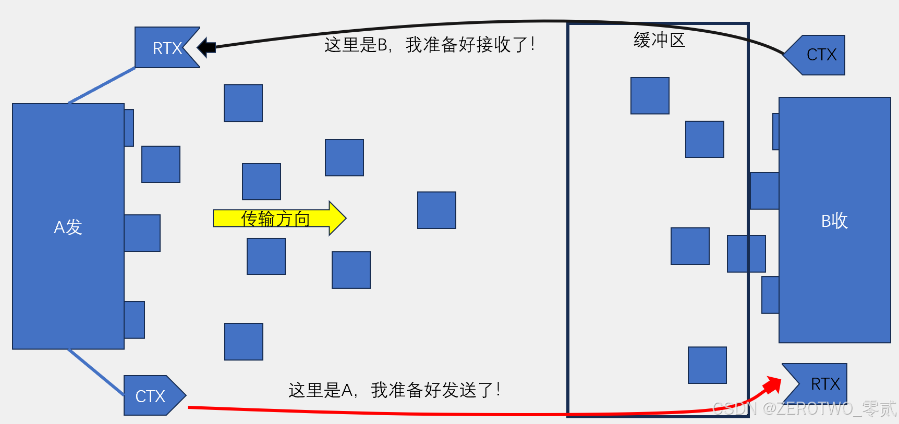

- 2. 物理层 (电平标准)

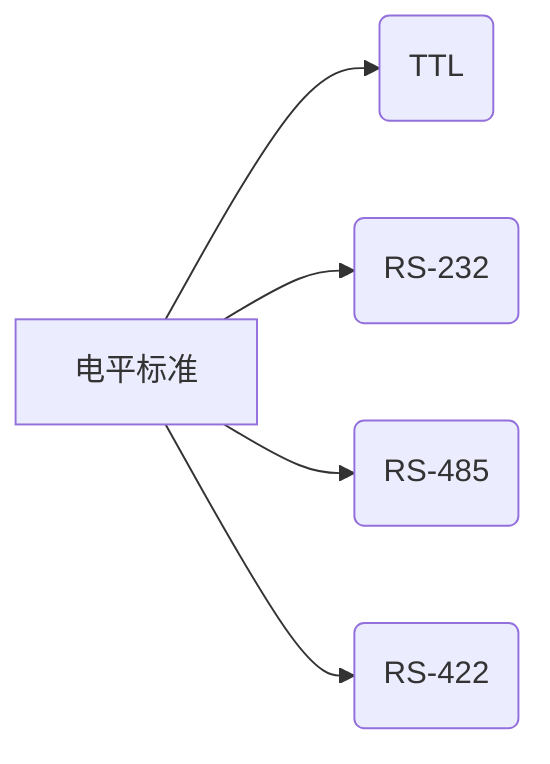
```mermaid
graph LR
A[电平标准]  --> B(TTL)
A --> C(RS-232)
A --> D(RS-485)
A --> E(RS-422)
```
*(RS = Recommended Standard)*

- TTL (Transistor-Transistor Logic)
  - **逻辑**：
    - 逻辑 **1** (高): 2.4V ~ 3.3V/5V
    - 逻辑 **0** (低): 0V ~ 0.4V
  - **特点**：芯片内部常用的电平，可以直接被 MCU 识别。
  - **缺点**：抗干扰弱，距离短。
 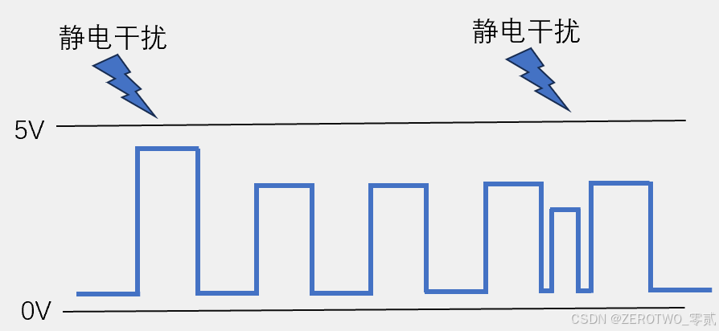

- RS-232
  - **逻辑**（**负逻辑**）：
    - 逻辑 **1**: -3V ~ -15V
    - 逻辑 **0**: +3V ~ +15V
  - **特点**：老式电脑 COM 口标准，传输距离稍长（<15米）。
  - **注意**：不能直接接 MCU，需要电平转换芯片（如 MAX232）。
 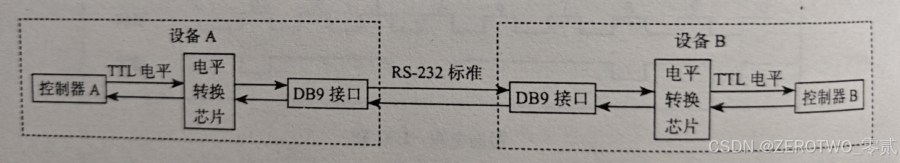

- RS-485
  - **逻辑**（**差分信号**）：
    - 逻辑 **1**: 压差 +2V ~ +6V (A > B)
    - 逻辑 **0**: 压差 -2V ~ -6V (A < B)
  - **特点**：抗干扰极强，支持**一主多从**，传输距离可达上千米。
  - **连接**：仅需两根线（A+, B-）。
 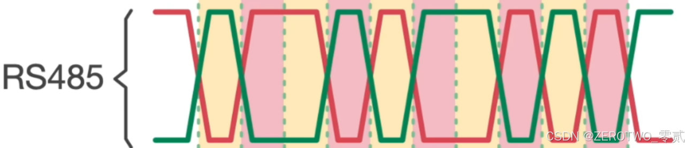

### 标准对比
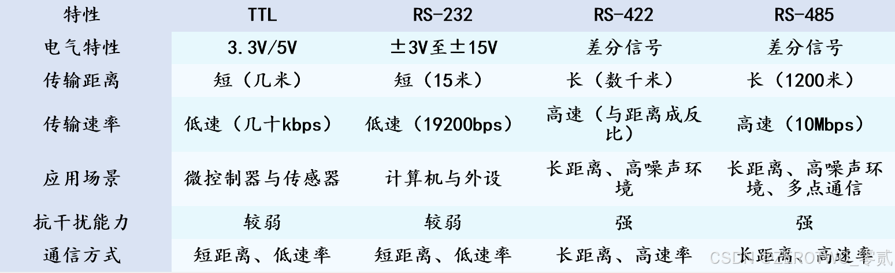

- 3. 协议层 (数据帧)
双方必须约定一致的格式才能正常解码。

- 帧格式
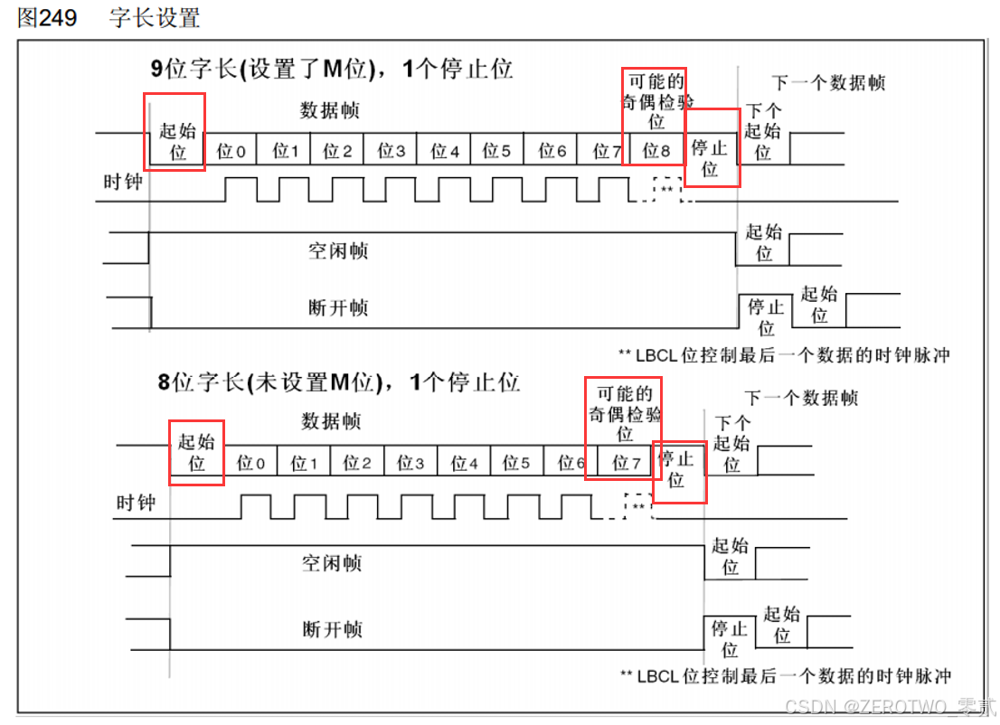

  - **起始位**：1位，逻辑 **0**。
  - **数据位**：5~8位，通常是 **8位** (1字节)。
  - **校验位**：
    - **奇校验 (Odd)**: 保证“1”的个数为奇数。
    - **偶校验 (Even)**: 保证“1”的个数为偶数。
    - **无校验 (None)**: 不使用。
  - **停止位**：1位或2位，逻辑 **1**。

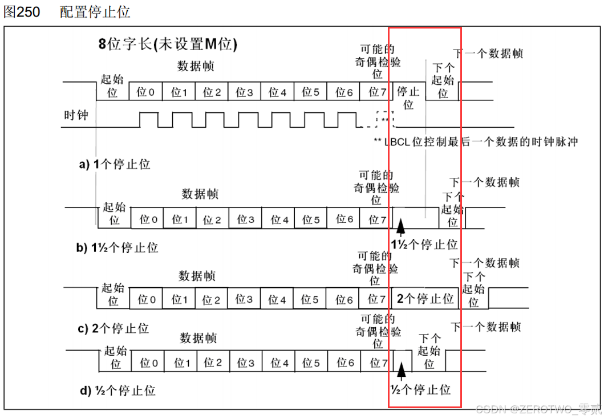

- 波特率 (Baud Rate)
  - 定义：单位时间内传输的码元个数（对于 UART，约等于每秒传输的 bit 数）。
  - 常用：9600, 115200。
  - **波特率越高，单位时间的码元长度越短**。

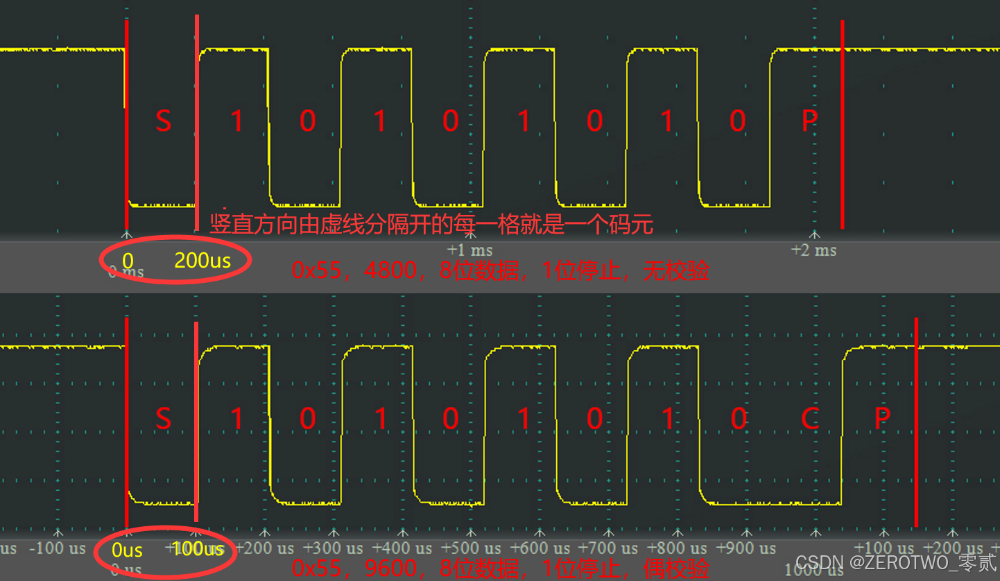

- 4. USART 与 UART 的区别
1.  **时钟信号**：
    - UART 只有异步通信（无时钟线）。
    - USART 支持同步通信（有单独的 SCLK 时钟线）。
2.  **应用场景**：
    - UART 适合低速、简单的控制。
    - USART 在同步模式下传输速率更高，且可用于驱动 SPI 设备等。
3.  **结构**：
    - 基本帧结构在异步模式下是一致的。
    
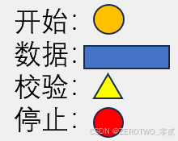

---

## 10. 参考资料
1. [什么是同步通信？什么是异步通信？](https://blog.csdn.net/qq_33738357/article/details/134119159)
2. [串行通信接口协议简介](https://blog.csdn.net/baidu_38797690/article/details/125397037)
3. [深入刨析 USART 与 UART 的区别](https://blog.csdn.net/W__winter/article/details/143221158)
4. [UART 串口流控制 (Flow Control)](https://blog.csdn.net/qq_42992084/article/details/104761474)

2025-1-26 10:05:01