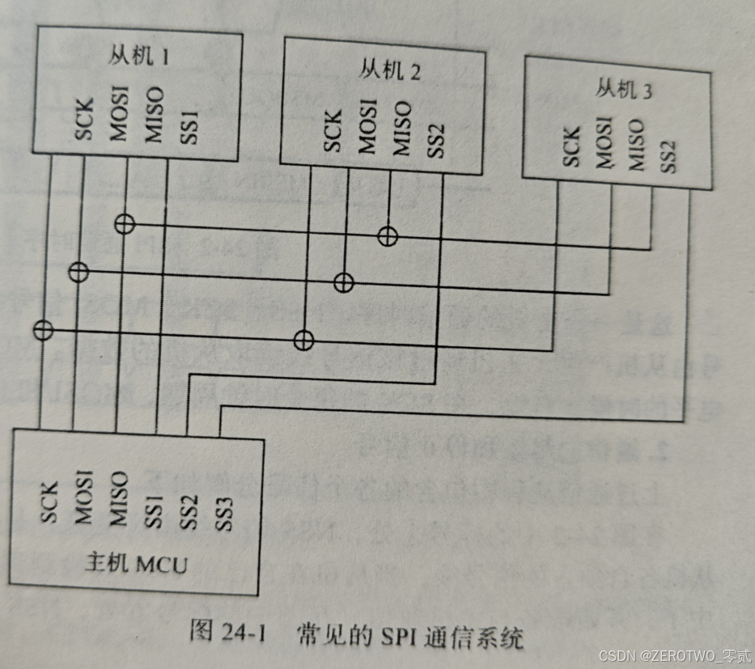
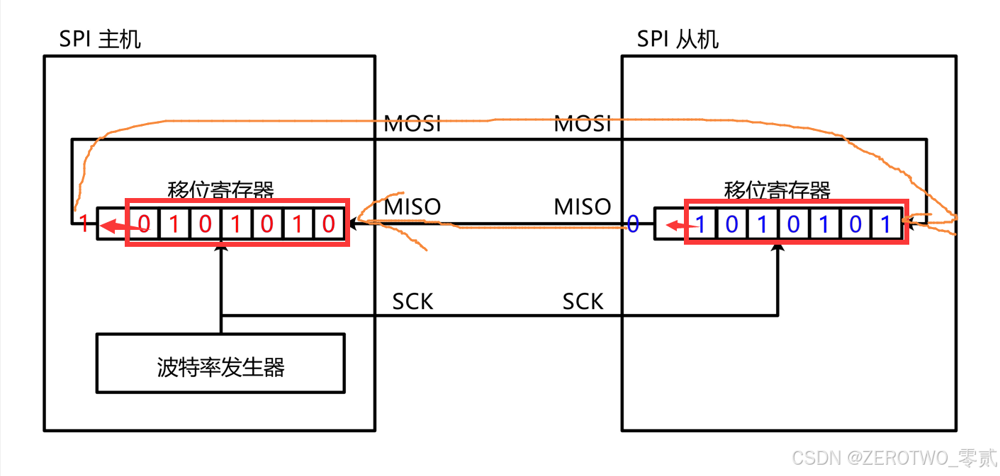
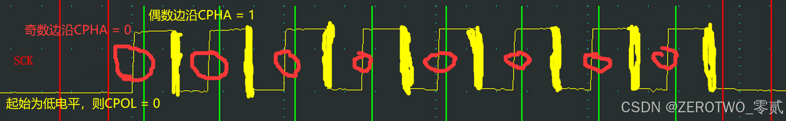
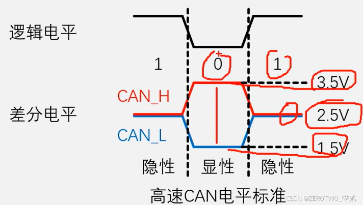
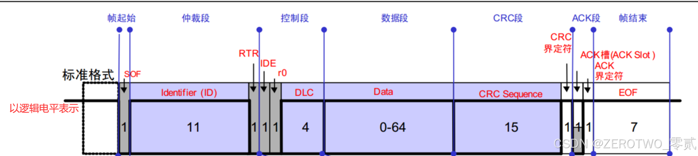
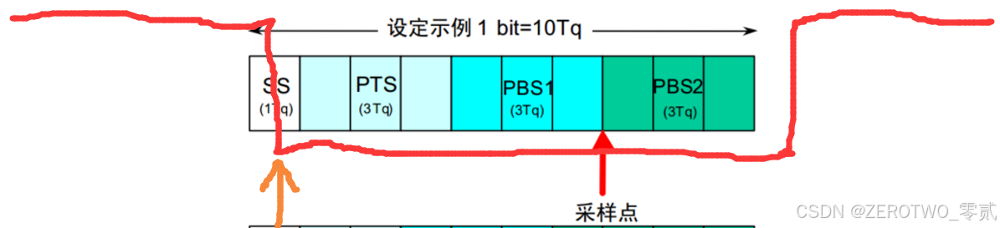
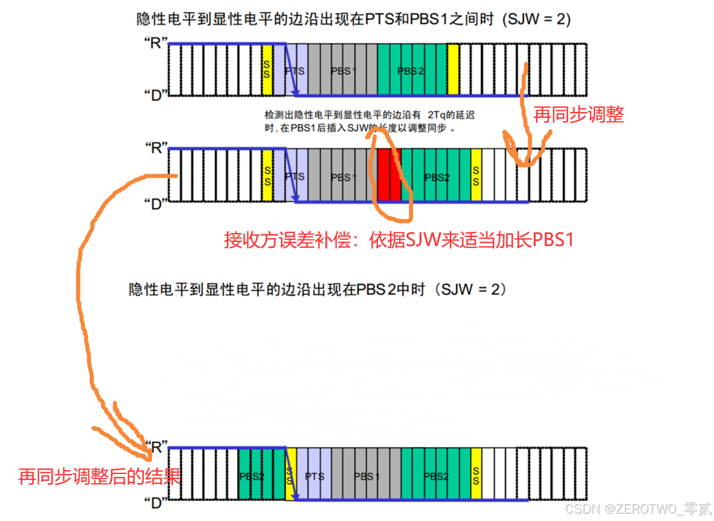

# SPI CAN

> **SPI** (Serial Peripheral Interface)，**CAN** (Controller Area Network)

- []SPI 通信
- []CAN 总线
- []参考文献

- **本文目标**：

---

## 目录

[[toc]]

---

## SPI 通信 (Serial Peripheral Interface)

### 1. 为什么需要 SPI？
> **问题背景**：UART 简单、方便，只用两根线就能通信，为什么还需要 SPI？

主要原因在于 **速度** 和 **架构** 的差异：

1.  **速度限制**：UART 是异步通信，通信速率受限于波特率（通常 < 1Mbps），且不仅要保证双方波特率一致，过高的波特率在长距离或干扰下容易导致位同步误差累积。
2.  **效率问题**：UART 的起止位、校验位等开销较大。
3.  **架构局限**：UART 通常用于点对点 (P2P) 通信，虽然 RS-485 可以组网，但协议处理较复杂。

**SPI 的优势**：
*   **高速**：同步通信，时钟由主机控制，速率可达数 10 Mbps (如 SD 卡、屏幕)。
*   **全双工**：独立的发送 (MOSI) 和接收 (MISO) 线路，数据传输效率高。
*   **主从架构**：支持多从机，硬件连接简单。

---

### 2. 物理层 (接口与引脚)

SPI 通常使用 4 条信号线：
*   **SCK (Serial Clock)**：时钟信号线，由**主机产生**。
*   **MOSI (Master Output Slave Input)**：主机输出，从机输入。
*   **MISO (Master Input Slave Output)**：主机输入，从机输出。
*   **CS/SS (Chip Select / Slave Select)**：片选信号线，通常**低电平有效**。

- 连接方式
*   **一对一**：直接连接。
*   **一对多**：
    *   **独立片选**：主机为每个从机连接一根独立的 CS 线（最常用）。
    *   **菊花链**：数据线串联（较少见，用于特定应用）。

> 💡 **通俗理解**
> - **SCK**：老师打的拍子（控制节奏）。
> - **CS**：老师点名，“张三，你来回答”（被选中的才干活）。
> - **MOSI**：老师对学生讲话。
> - **MISO**：学生回答老师。

---

### 3. 协议层

- 3.1 传输机制：交换核心
SPI 的通信本质是 **移位寄存器 (Shift Register)** 的数据交换。
*   主机和从机各有一个移位寄存器。
*   在时钟脉冲下，主机发出 1 bit (MOSI)，同时接收 1 bit (MISO)。
*   **“与其说是在发送和接收，不如说是在交换数据”**。
    *   如果你只想发送：忽略接收到的数据。
    *   如果你只想接收：发送空数据 (Dummy Byte) 去交换回想要的数据。

- 3.2 起止与时序
*   **起始**：CS 从 **高 -> 低**。
*   **结束**：CS 从 **低 -> 高**。
*   **位序**：通常是 **MSB First** (高位先传)，但也可配置为 LSB First。

- 3.3 四种通信模式 (CPOL/CPHA)
由两个参数决定：
1.  **CPOL (Clock Polarity) 时钟极性**：空闲时（没传数据时）SCK 的电平。
    *   0: 空闲为低电平。
    *   1: 空闲为高电平。
2.  **CPHA (Clock Phase) 时钟相位**：数据在第几个边沿采样。
    *   0: 第 1 个边沿采样（奇数边沿）。
    *   1: 第 2 个边沿采样（偶数边沿）。

| 模式 | CPOL | CPHA | 描述 |
| :--- | :--- | :--- | :--- |
| **Mode 0** | 0 | 0 | 空闲低，**上升沿**采样 (最常用) |
| **Mode 1** | 0 | 1 | 空闲低，**下降沿**采样 |
| **Mode 2** | 1 | 0 | 空闲高，**下降沿**采样 |
| **Mode 3** | 1 | 1 | 空闲高，**上升沿**采样 (常用) |
    

---

## CAN 总线 (Controller Area Network)

> **特点**：多主控制、差分传输、抗干扰强、自带错误检测。常用于汽车、工业控制。

### 1. 物理层
CAN 使用 **差分信号** (CAN_H, CAN_L)，无需共地。

| 状态 | 逻辑值 | 信号电平 | 说明 |
| :--- | :--- | :--- | :--- |
| **显性 (Dominant)** | **0** | CAN_H > CAN_L (压差约 2V) | **优先权高** (总线上只要有一个发 0，就是 0) |
| **隐性 (Recessive)** | **1** | CAN_H ≈ CAN_L (压差约 0V) | 类似于“弹簧”，无人操作时自动回弹到 1 |

> **终端电阻**：高速 CAN 需要在总线两端各并联一个 **120Ω** 电阻。
> 1.  **消除反射**：防止高频信号回波。
> 2.  **确保隐性电平**：在无人发显性信号时，快速将两线电压拉到同一水平。

### 2. 协议层 (帧格式)

CAN 有 5 种帧类型，最重要的是 **数据帧**。

- 标准数据帧结构

1.  **SOF (起始位)**：1 位显性 (0)。
2.  **Arbitration (仲裁段)**：
    *   **ID (报文标识符)**：11 位 (标准) 或 29 位 (扩展)。**ID 越小，优先级越高**。
    *   **RTR**：区分数据帧 (0) 和遥控帧 (1)。
3.  **Control (控制段)**：包含 **DLC** (数据长度，0~8 字节)。
4.  **Data (数据段)**：实际载荷 (0~8 Bytes)。
5.  **CRC (校验段)**：15 位 CRC + 1 位界定符。
6.  **ACK (应答段)**：
    *   发送方发 **隐性 (1)**。
    *   接收方若收到正确数据，必须在 ACK 位发 **显性 (0)** 拉低总线。
7.  **EOF (帧结束)**：7 个连续隐性位 (1)。

- 关键机制
*   **线与机制 (Wired-AND)**：显性 (0) 会覆盖 隐性 (1)。这是仲裁的基础。
*   **位填充 (Bit Stuffing)**：每 5 个连续相同电平，自动插入 1 个反相位的填充位。
    *   作用1：防止错误帧/过载帧误判。
    *   作用2：**提供足够多的跳变沿，用于接收方同步时钟**。

### 3. 位时序与同步 (Bit Timing & Synchronization)

CAN 是异步通信，没有时钟线，但对时序要求极高。每个“位”被切分为 4 段：

1.  **SS (Sync Seg, 同步段)**：固定 1 Tq。**期望的跳变沿**应出现在这里。
2.  **PTS (Prop Seg, 传播时间)**：补偿物理延迟 (导线传输 + 芯片处理)。
3.  **PBS1 (Phase Seg 1, 相位缓冲1)**：用于补偿**慢**的时钟误差。
4.  **PBS2 (Phase Seg 2, 相位缓冲2)**：用于补偿**快**的时钟误差。
    *   **采样点**：位于 PBS1 和 PBS2 之间。

- 同步机制
分为 **硬同步** 和 **再同步** (Resynchronization)：

    - 硬同步 (Hard Sync)
*   **发生时刻**：接收方检测到帧起始位 (SOF) 时。
*   **动作**：强制将自己的位时序重置，让 SS 段对齐当前的跳变沿。("军训集合，立正")

    - 再同步 (Resynchronization)
*   **发生时刻**：在数据传输过程中，检测到跳变沿不在 SS 段。
*   **调整工具**：**SJW** (Synchronization Jump Width, 再同步跳转宽度)。
*   **调整规则**：
    1.  **慢了 (发晚了)**：跳变沿出现在 SS 之后 (如 PTS 或 PBS1 中)。-> **延长 PBS1** (多等一会)。
    2.  **快了 (发早了)**：跳变沿出现在 SS 之前 (上一位的 PBS2 中)。-> **缩短 PBS2** (少等一会，赶快进入下一位)。

> 💡 **总结**
> - **硬同步**：用于帧开头，一次对其。
> - **再同步**：用于帧中间，微调误差，防止累积。
> - **SJW**：规定了每次微调的最大步幅 (通常 1~4 Tq)，防止调整过猛。

---

## 参考资料
1. [江协科技 CAN 总线入门教程](https://www.bilibili.com/video/BV1vu4m1F7Gt)
2. *本文图片大部分来源于江协科技 CAN 总线教程 PPT，感谢江协科技！*

2025-2-27