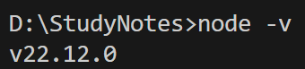
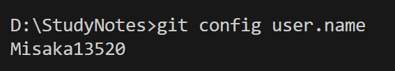

# 使用Vuepress实现静态博客
- 系统：Windows 11

> Vuepress 是一个基于 Vue 的静态网站生成器，它可以快速搭建一个静态博客。
> 以下是使用 Vuepress 创建静态博客的步骤：
- []创建项目目录
- []Node.js 环境安装
- []Git 环境安装
- []Vuepress 安装与配置
- []创建目录结构与文件
- []界面美化
- **本文目标**：创建一个本地Vuepress静态博客。

---

## 目录

[[toc]]

---

## 1. 创建项目目录
- 创建一个名为 StudyNotes 的项目目录，并在VScode 中打开目录。

## 2. Node.js 环境安装
> Node.js 是一个 JavaScript 运行环境，用于构建服务器端应用程序。在本项目中，Node.js 我们需要下载v22.12.0以上的版本【1】。
- [Node.js官网](https://nodejs.org/zh-cn/download)
本案例在node.js官网下载时，我们不选择下载使用Docker的node.js镜像，而是选择下载 .msi 结尾的安装包直接装【2】。
- [快捷下载Node.js-v22.12.0(Win-X64)](https://nodejs.org/dist/v22.12.0/node-v22.12.0-x64.msi)
下载完，双击运行安装包 -> 一路点击 Next -> 重启目录夹 -> 打开终端（ctrl ~）-> 输入命令`node -v`检查版本与是否安装成功
 > 

## 3. Git 环境安装
> Git 是一个开源的分布式版本控制软件，用于管理代码的版本控制。本项目中，Git 我们需要下载v2.x以上的版本。
- [Git官网](https://git-scm.com/downloads)下载选择64-bit Git for Windows Setup -> 安装时一路 Next 到底即可（默认选项就很完美，不用改）-> 检查一下 Git 身份信息
```bash
git config user.name
git config user.email
```
> 输出结果：
> 
>> 如果没输出，执行：
```bash
git config --global user.name "改为你的GitHub用户名"
git config --global user.email "改为你的GitHub邮箱"
```
## 4. Vuepress 安装与配置
> Vuepress 是一个基于 Vue 的静态网站生成器，它可以快速搭建一个静态博客。[Vuepress官网](https://vuepress.vuejs.org/zh/)
- 初始化项目：
```bash
npm init -y
```
这一步会瞬间生成一个 `package.json` 文件，不用管它
- 安装 Vuepress：在终端输入以下指令
```bash
npm install -D vuepress@next
npm install -D @vuepress/theme-default @vuepress/bundler-vite
npm install -D sass-embedded
```
如果有警告 warning 不用管，只要不报错 error 就行
- 验证安装：安装完成后，你会看到左侧文件列表里多了一个 `node_modules` 文件夹和一个`package-lock.json` 文件。
- 配置启动脚本:打开 `package.json`文件,找到 `scripts`节点，并启用现代模式
```json
{
  "name": "studynotes",
  "version": "1.0.0",
  "type": "module",    <-- 这一行非常重要！
  "scripts": {
    "docs:dev": "vuepress dev docs",     
    "docs:build": "vuepress build docs"   
  },
  "devDependencies": {
     ... (下面这些不用管)
  }
}
```
Ctrl+S保存
- 配置主题：在 `docs` 文件夹里，新建一个文件夹 叫 `.vuepress` (前面有个点)。
所以现在的目录结构应该是这样的：
```text
StudyNotes/
└── docs/
    ├── .vuepress/   <-- 新建这个
    ├── guide/
    └── README.md
```
- 在 `.vuepress` 文件夹里，新建一个文件 叫`config.js`并粘贴以下代码
```javascript
import { defaultTheme } from '@vuepress/theme-default'
import { defineUserConfig } from 'vuepress'
import { viteBundler } from '@vuepress/bundler-vite'

export default defineUserConfig({
  lang: 'zh-CN',
  title: '我的学习笔记',
  description: '这是我的个人博客',

  theme: defaultTheme({
    logo: '/',//输入logo的地址或删掉
    navbar: [
      { text: '首页', link: '/' },
      { text: '笔记', link: '/guide/intro.md' },
    ],
  }),

  bundler: viteBundler(),
})
```


## 5. 创建目录结构与文件
::: tip 提示
以下配置是关键！
:::
- 创建目录结构：Vuepress的规则是**文件夹结构 = 网站结构**,所以创建`docs`的文件夹，并创建一个名为`README.md`的文件，内容如下可以自行修改：
```markdown
---
home: true
heroImage: # 首页大图，如果没有图片，可以删掉这行，或者放一个网络图片地址
heroText: 我的学习笔记
tagline: 积跬步以至千里，致敬每一行代码。
actions:
  - text: 🚀 快速开始
    link: /guide/
    type: primary
  - text: 🐱 GitHub
    link: https://github.com/你的Github用户名
    type: secondary

features:
  - title: 💡 基础知识
    details: 记录编程语言的基础语法、核心概念与常见面试题。
  - title: 🛠️ 实战项目
    details: 从零搭建项目的全过程记录，踩坑与填坑的经验分享。
  - title: 📚 读书笔记
    details: 阅读技术书籍的精华摘要与个人感悟。

footer: MIT Licensed | Copyright © 2026 Misaka

---

## 欢迎来到我的博客

“这里可以写一些自我介绍，或者置顶内容。”
```
- 在 `docs` 文件夹里，新建一个文件夹 叫 `guide`在 `guide` 文件夹里，新建一个文件 叫 `intro.md`。
以后需要创建新的文件（blog），请放在 `guide` 文件夹下，并使用 `.md` 扩展名。
- 修改`config.js`文件，就可以添加新的文件（blog）与侧边栏：
```javascript
// 左侧侧边栏 (不同子路径可以配不同的侧边栏)
    sidebar: {
      '/guide/': [
        {
          text: '简介',
          collapsible: true, // 是否可折叠
          children: [
            '/guide/intro.md', // 这里对应文件 docs/guide/intro.md
            // 以后在这里加新文件，比如 '/guide/docker.md'
          ],
        },
        // 添加新的侧边栏
        {
          text: 'Vuepress静态blog配置搭建',
          collapsible: true,
          children: [
            '/guide/note1.md',
          ],
        },

      ],
    },
```
- 启动项目：在终端输入以下指令
```bash
npm run docs:dev
```
然后你会看到绿色的`http://localhost:8080/`链接，通过Ctrl+点击链接，就可以打开浏览器，访问 `http://localhost:8080/`，可以看到你的博客。

## 6. 界面美化
> VuePress 的默认主题使用了 SCSS 来写样式，底层的打包工具 Vite 现在默认要求使用性能更好的 sass-embedded 编译器来处理这些样式文件。
- 在`docs/.vuepress/` 文件夹下，新建一个文件夹叫 `public`用于后续存放图片。VuePress 规定：放在 `public` 里的文件，打包时会被自动复制到网站根目录。在`readme.md` 中的`heroImage` 处添加首页大图;在`config.js`中的`logo`处添加logo。
"

- 如果觉得图小想要实现“大图铺满背景 + 底部渐变虚化 + 文字在上方清晰可见”等需求，我们需要利用 CSS 的 ::before 伪元素技术，创建一个“虚拟层”放在文字下面，专门放图片和做虚化处理，这样就不会影响到文字的清晰度。此处不做过多赘述，使用AI进行代码编写或请自行查看[官方文档](https://vuepress.vuejs.org/zh/guide/custom-theme.html#%E5%AE%89%E8%A3%85-sass-%E7%BB%84%E4%BB%B6)。

## 【】解释
- [^1]:vuepress@next（最新版）自动下载了底层的构建工具 Vite 7.0。根据最新的技术要求，Vite 7.0 强制要求 Node.js 版本必须高于 v20.19.0 或 v22.12.0，因为它使用了一个叫 crypto.hash 的新功能。如果不小心下载旧版本的 Node.js，直接选择[快捷下载的 Node.js-v22.12.0(Win-X64)](https://nodejs.org/dist/v22.12.0/node-v22.12.0-x64.msi)就行，会自动覆盖旧版本。
- 【2】：现在的目标是“造一个博客”，而Docker 是用来“运送货物（代码）的集装箱”，需要额外学习虚拟化、镜像、容器网络等一大堆对于做博客完全没必要的知识，后期升级时再考虑......
