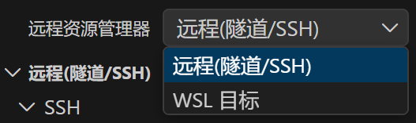

# 基于VSCode使用SSH连接远程云端服务器

- **系统**：Windows 11
- **前提**：已有一台 Linux 云服务器。

> 云服务器是运行 Linux 的服务器，你可以在云服务商上搭建一个云服务器，然后使用 SSH 连接它，就像在局域网内一样。连接云服务器主要使用的是 **Remote - SSH** 功能，本文将带你一步步完成配置。

- []准备服务器信息
- []安装Remote - SSH和Remote Explorer扩展
- []配置并连接云服务器
- **本文目标**：在 VSCode 中通过 SSH 连接到你的云服务器，像在本地一样编写代码、使用终端。

---

## 目录

[[toc]]

---

## 1. 准备服务器信息

在开始之前，你需要确认从云服务商那里获取了以下 **3 个信息**：

| # | 信息 | 说明 |
|---|------|------|
| 1 | **公网 IP 地址** | 例如：`123.45.67.89` |
| 2 | **用户名** | 通常是 `root`，如果是 Ubuntu 系统有时默认是 `ubuntu` |
| 3 | **登录密码**（或 SSH 密钥） | 在云服务商控制台设置 |

::: tip 提示
这些信息可以在云服务商的**控制台 → 云服务器实例详情**页面找到。如果忘记密码，可以在控制台重置。
:::

---

## 2. 安装Remote - SSH和Remote Explorer扩展
>Remote Explorer 是一个 VSCode 的插件，用于管理远程资源，比如云服务器上的文件。

> SSH（安全外壳协议）是一种用于安全远程登录和其他网络服务的加密协议，广泛应用于系统管理、文件传输和远程命令执行等场景。

SSH 连接需要单独安装两个扩展：

1. 在 VSCode 左侧边栏点击 **扩展 (Extensions)**（图标是四个方块）
2. 搜索框输入 **Remote - SSH**
3. 找到由 **Microsoft** 官方提供的 `Remote - SSH` 扩展，点击 **安装**
4. 搜索框输入 **Remote Explorer**
5. 找到由 **Microsoft** 官方提供的 `Remote Explorer` 扩展，点击 **安装**

::: warning 注意
请认准 Microsoft 官方发布的扩展（有蓝色小勾），不要装错成第三方同名扩展。
:::

---

## 3. 配置并连接云服务器

这一步是核心操作，按顺序跟着做就行：

- 点击 VSCode 左侧边栏的 **"远程资源管理器"** 图标（长得像一台显示器）。

::: tip 提示
如果顶部下拉菜单显示的是 WSL，请将其切换为 **Remotes (Tunnels/SSH)**。

:::

- 添加新服务器：在 **SSH** 这一栏的旁边，点击 **`+`（加号）** 图标。然后在VSCode 顶部弹出的一个输入框，在这里输入 SSH 连接命令，格式为：

```bash
ssh -p 端口号 用户名@服务器IP
```
选择配置文件，选择**第一个默认路径**即可（通常是 `C:\Users\你的用户名\.ssh\config`）。

::: details 什么是 .ssh/config？
这是一个 SSH 配置文件，用来保存你的远程连接信息。以后重新打开 VSCode 时，就不用再手动输入 IP 了，VSCode 会自动读取这个文件里的配置。你也可以手动编辑它来管理多台服务器。
:::

- 配置保存成功后：在左侧的"远程资源管理器"中，找到你刚添加的 IP连接即可
- 首次连接会有几个确认步骤：顶部会提示你选择远程主机的平台，选择 **Linux**最后，在提示框中 **输入你的服务器密码** 并回车

::: warning 首次连接较慢属于正常现象
首次连接时，VSCode 会自动在你的云服务器上下载并安装一些必要的服务端组件（VS Code Server），这需要稍微等待十几秒钟，取决于服务器带宽。之后再次连接就会很快了。
:::

---


::: tip 小贴士
在远程环境下，VSCode 的终端（`` Ctrl + ` ``）直接就是服务器的 Shell，你可以在里面执行 `apt`、`docker`、`git` 等任何 Linux 命令，非常方便。
:::

---

## 【补充】配置 SSH 密钥免密登录

每次连接都输密码比较麻烦，可以配置 SSH 密钥实现**免密登录**：

1. 在本地 Windows 终端（PowerShell）中生成密钥对：
```powershell
ssh-keygen -t rsa -b 4096
```
一路回车（默认路径、不设密码短语）即可，会在 `C:\Users\你的用户名\.ssh\` 下生成 `id_rsa`（私钥）和 `id_rsa.pub`（公钥）。

2. 将公钥上传到服务器：
```powershell
type $env:USERPROFILE\.ssh\id_rsa.pub | ssh root@123.45.67.89 "mkdir -p ~/.ssh && cat >> ~/.ssh/authorized_keys"
```

3. 上传完成后，再次用 VSCode 连接时就不用输入密码了。

::: danger 重要
私钥文件 `id_rsa` 绝对不能泄露给任何人！它相当于你服务器的"钥匙"。只有 `.pub` 结尾的公钥才可以分享。
:::
