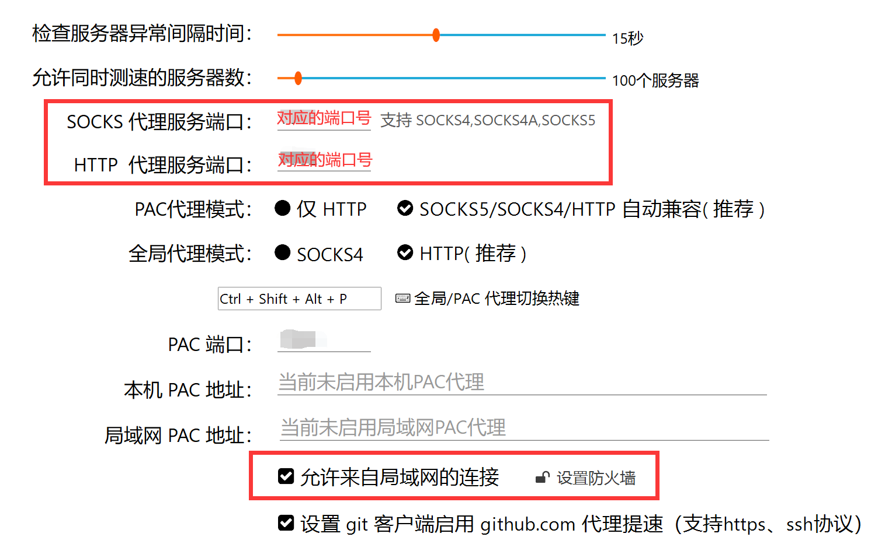
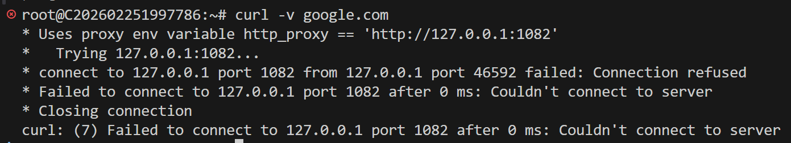

# WSL和云VPS科学上网

- **系统**：Linux(Ubuntu 22.04+)

> WSL 和云 VPS 运行的都是 Linux 系统，但 WSL 的网络环境与云 VPS 的网络环境不同。

- []WSL通过内网 IP实现科学上网 
- []云VPS和WSL的网络环境差异
- []解决云VPS科学上网问题
- **本文目标**：理清WSL和云VPS的网络环境差异，并解决科学上网问题。
---

## 目录

[[toc]]

---
## 1. WSL通过内网 IP实现科学上网

> WSL允许用户在Windows环境中直接允许Linux，同时这意味着从本质上来说WSL是一个本地虚拟机。

- 动态获取 Windows 的本地局域网IP
```bash
export hostip=$(ip route show | grep default | awk '{print $3}')
```
- 网络连通性：需要在主机上的网络代理服务器中打开**“允许来自局域网的连接”**，并且放行对应端口的防火墙（后续操作中也需要打开防火墙）
- 设置终端代理环境变量：在 WSL 中，你需要设置代理，你可以使用 `export` 命令来设置代理。例如：
```bash
export http_proxy="http://$hostip:HTTP代理服务器端口号"
export https_proxy="http://$hostip:HTTP代理服务器端口号"
export all_proxy="socks5://$hostip:SOCKS代理服务器端口号"
```

- 可以将以上命令添加到 `~/.bashrc` 文件中，这样每次启动 WSL 时，代理都会自动设置。
- 测试代理：你可以使用 curl 命令来测试代理是否生效。例如：
```bash
curl -v google.com
```
与本条步骤同理，相关局域网的网络设置也一样。

## 2. 云VPS和WSL的网络环境差异

> 云VPS是远程的物理主机，和WSL不同，云VPS的IP是公网IP，WSL的IP是局域网IP。

- 云VPS障碍：云VPS是远程物理主机，远在公网上，它执行 `ip route show...` 只能拿到云服务商机房的网关 IP。**云服务器无法直接访问你电脑的内网 IP**，自然也就连不上你 的代理。

## 3. 解决云VPS科学上网问题

> 当前状态下的云VPS无法使用GitHub、Docker，无法使用源码安装 clash-for-linux-cli。

### 3.1：使用SSH反向代理，连接到本地的代理服务器：登录你的云服务器，编辑 `~/.bashrc`，加入以下代码
```bash
# ====================================================
# 云服务器 代理配置 (通过 SSH 隧道连接本地 Windows)
# ====================================================
# 注意：这里直接填 127.0.0.1，因为我们将通过 SSH 隧道把本地端口映射过来
export http_proxy="http://$hostip:HTTP代理服务器端口号"
export https_proxy="http://$hostip:HTTP代理服务器端口号"
export all_proxy="socks5://$hostip:SOCKS代理服务器端口号"

alias unproxy='unset http_proxy https_proxy all_proxy && echo "代理已关闭"'
alias setproxy='export http_proxy="http://127.0.0.1:1082" https_proxy="http://127.0.0.1:1082" all_proxy="socks5://127.0.0.1:1081" && echo "代理已开启"'
# ====================================================
```
- 写完后在终端执行:
```bash
source ~/.bashrc
```
### 3.2：同理使用 SSH 反向代理，在本地执行以下命令，把本地代理端口映射给 VPS
::: tip 提示
注意手动在本地的防火墙里添加入站规则，放行 SOCKS_PORT 和 HTTP_PORT 端口。
:::
```bash
ssh -N -R SOCKS_PORT:127.0.0.1:SOCKS_PORT -R HTTP_PORT:127.0.0.1:HTTP_PORT user@your-vps-ip
```
::: tip 提示
这句话的意思是，连接云服务器的同时，在云服务器上开通 SOCKS_PORT 和 HTTP_PORT 端口，任何发往云服务器这两个端口的数据，都会通过 SSH 加密通道，原路返回给本地的 HTTP_PORT 和 SOCKS_PORT 端口（也就是交给了你的网络代理服务器）。
:::

> 如果出现如下的类似报错，请检查你的SSH隧道是否启动？

并验证隧道状态在云VPS端执行：
```bash
netstat -tlnp | grep HTTP_PORT
或
ss -tlnp | grep HTTP_PORT
```
如果看不到监听的1082端口，说明隧道确实没建立。


### 3.3：云VPS 安装并配置 Proxychains
> proxychains4 的作用是让不支持代理的命令行工具通过代理访问网络。
  - 安装 Proxychains
```bash
# Debian/Ubuntu
              sudo apt update
              sudo apt install proxychains4 -y

              # CentOS/RHEL
              sudo yum install proxychains-ng -y
```
  - 配置 Proxychains,编辑 /etc/proxychains4.conf，在末尾添加：
```bash
socks5 127.0.0.1 SOCKS_PORT 
```
::: tip 提示
端口要对应步骤二的反向端口。
:::

### 3.4：通过代理安装 clash-for-linux-cli
- 后续所有需要外网的命令都用 Proxychains 包裹：
```bash
proxychains4 git clone --branch master --depth 1 https://gh-proxy.org/https://github.com/nelvko/clash-for-linux-install.git

cd clash-for-linux-install 

proxychains4 bash install.sh
```
- 尚未写完......

## 4. 参考文献与致谢
- 参考文献：[云端 VPS 连接不到外网？这样救回来](https://orangetz07.github.io/StudyNotes/exp/sys/vpsnetwork/)
- 致谢：[orangetz07](https://github.com/orangeTZ07)
