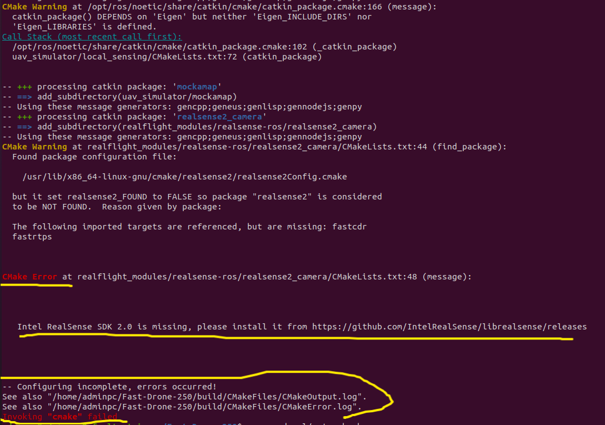
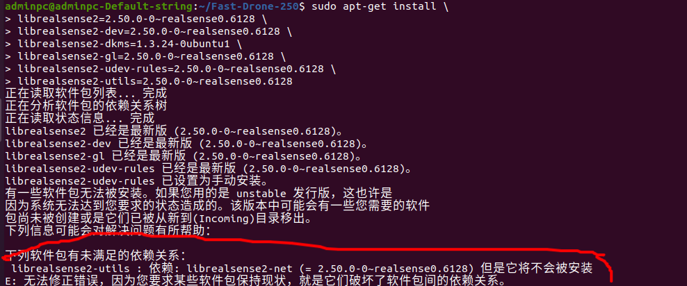
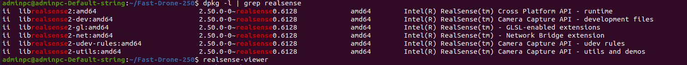
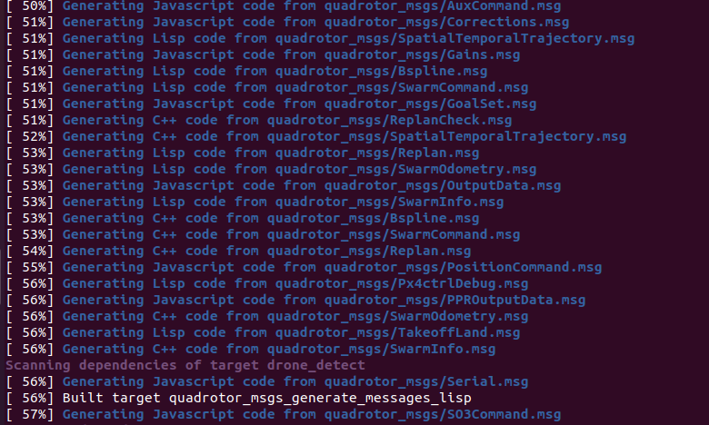
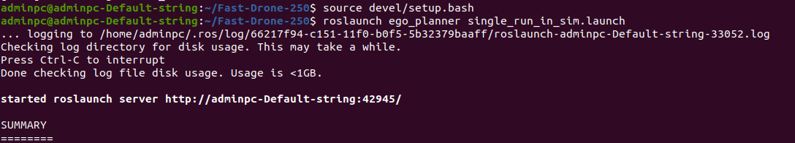
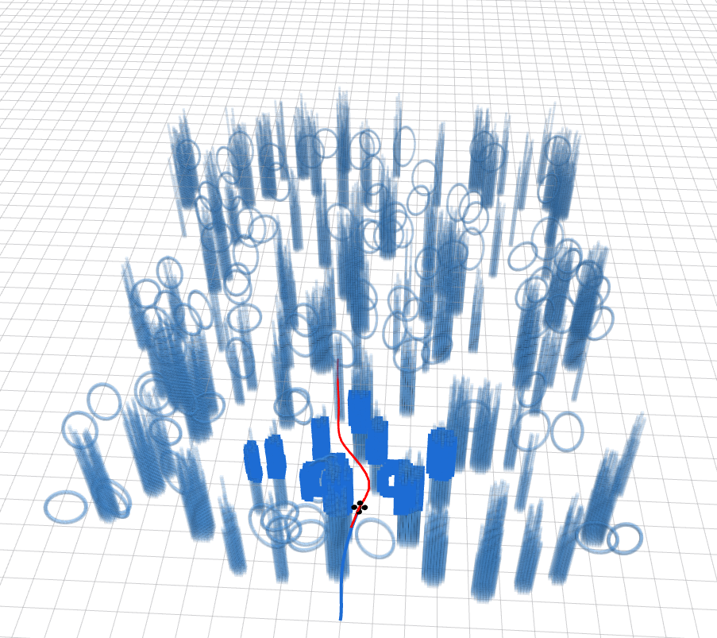

# 编译EGO-Planner源码并编译时遇到Intel-RealSense SDK找不到的问题

- **系统**：Ubuntu 20.04

> EGO-Planner是一种先进的无人机自主规划算法，主要通过轨迹规划状态机和控制源切换机制实现高效的路径规划和环境感知。

- **本文目标**：分析清楚并解决报错。
---

## 目录

[[toc]]

---
## 报错展示与分析：
- 在配置完ROS、realsense驱动、mavros、ceres、glog与ddyanmic-reconfigure后。对EGO-Planner源码进行编译的时候出现如下报错
 
 

 - 原因：直接使用realsense2的配置文件配置的Intel-RealSence SDK 版本大于2.50，而ROS1的noetic环境下并不支持高版本，所以需要降低Intel-RealSence SDK 的版本。而2.50版本是最后一个完全支持ROS1的版本。
---
## 解决：
- 首先通过命令将源文件删除

```python
sudo dpkg --purge $(dpkg -l | grep "realsense" | cut -d " " -f 3)
```

- 通过命令安装所有包
```python
sudo apt-get install \
librealsense2=2.50.0-0~realsense0.6128 \
librealsense2-dev=2.50.0-0~realsense0.6128 \
librealsense2-dkms=1.3.24-0ubuntu1 \
librealsense2-gl=2.50.0-0~realsense0.6128 \
librealsense2-udev-rules=2.50.0-0~realsense0.6128 \
```
然后会出现如下信息：


- 安装缺失的net包

```python
sudo apt-get install \
librealsense2-net=2.50.0-0~realsense0.6128 \
librealsense2-utils=2.50.0-0~realsense0.6128
```
- 然后检查所有安装的包

```python
# 检查所有安装的包
dpkg -l | grep realsense

# 测试 RealSense 查看器
realsense-viewer
```



- 最后，再次编译，出现百分比的进度就说明没问题了!


然后启动！



感谢fastlab实验室开源！
2025-11-14 20:39:12