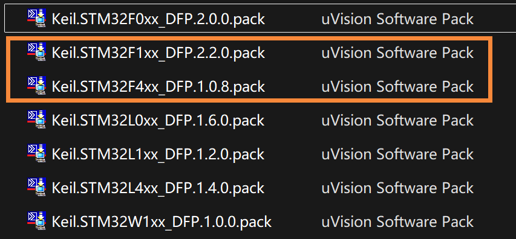
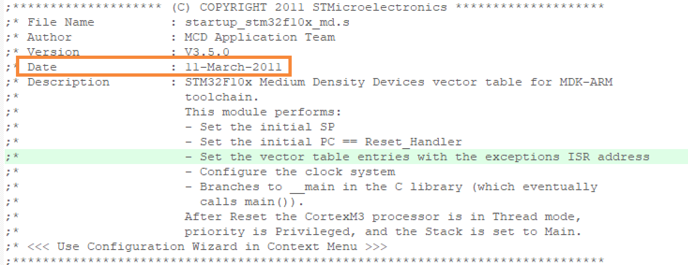
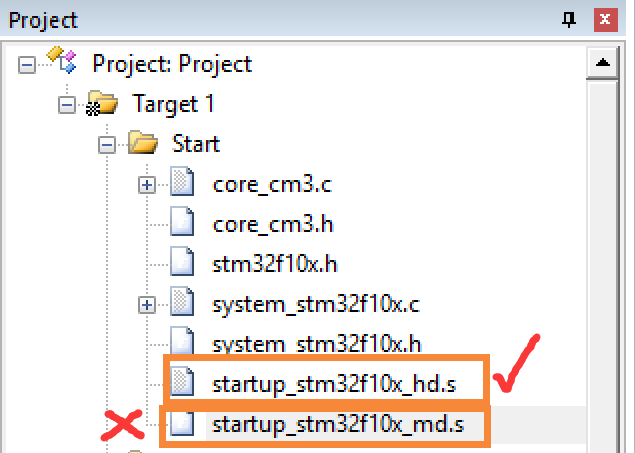
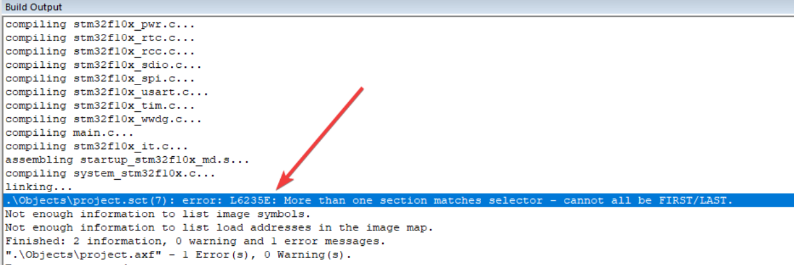
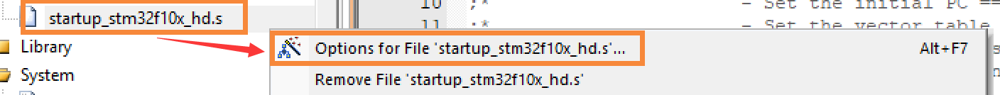
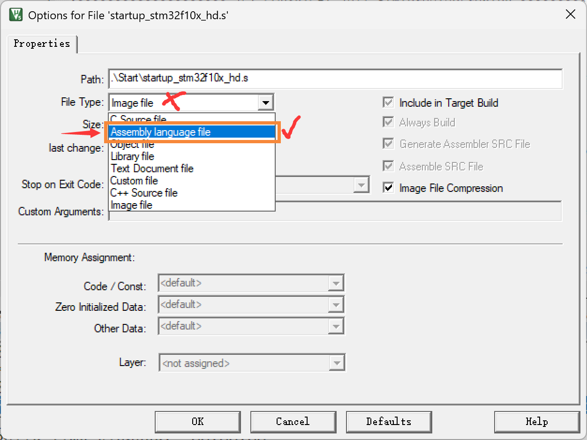

# 基于江协标准库所出现的定时器5678以及串口45等片上外设无法使用的问题解析

- **系统**：无（裸机开发）

>STM32是32位单片机。

- **本文目标**：分析清楚并解决问题。
---

## 目录

[[toc]]

---
## 出现的问题：
1. 当正确的初始化配置定时器5\6\7\8等（除TIM1\2\3\4以外的定时器）时，使用定时器所对应的中断函数后，出现0错误0警告但是**单片机运行卡死的现象。**
2. 当正确的初始化配置串口4、5等（除串口1、2、3以外的串口）时，使用串口中断函数，发现无法接收和发送数据，且**单片机出现运行卡死的现象。**

## 原因分析
- 芯片支持包太老
在正确配置的前提下：
基于江协的STM32标准库中所使用的芯片支撑包太过古老，用的还是2011年的老古董。

然而目前已经更新到了2.4.1了（2022~2023年版本的），芯片包获取：[Kell.ARM官网](https://www.keil.arm.com)

## 详细步骤：
- 访问Keil官网‌

1. 打开 Arm Keil 官方网站（www.keil.arm.com 或 www.keil.com）。 ‌
2. 点击顶部菜单栏的 ‌Products‌ 或 ‌Hardware‌，选择 ‌Device List‌ 进入芯片列表页面。 ‌
3. 选择STM32芯片型号‌
4. 在 ‌Vendor‌ 下拉菜单中选择 STMicroelectronics，然后在 ‌Core‌ 中选择对应的 Cortex-M 内核（如不确定可不选）。 ‌
或直接在搜索栏输入芯片型号（如STM32F103）筛选。 ‌
找到目标型号（例如 STM32F103C8）后点击进入详情页。 
‌下载芯片支持包（DFP）‌

5. 在芯片详情页找到 ‌STM32F1xx_DFP‌ 或类似命名的选项，点击 ‌Download Recommended Pack‌ 或 ‌Get Pack‌ 下载。
6. 部分型号可能需要通过 ‌CMSIS Pack‌ 链接下载。‌
7.  注意事项‌：
若需离线安装，双击下载的 .pack 文件即可自动安装。

保持默认路径安装即可，记住刚才的路径回到路径下的文件夹，把之前版本的支持包删掉。

## 启动文件需要更改
1. 江协的工程模板下用的是`startup_stm32f10x_md.s`打开这个文件会发现里面并没有TIM5\6\7\8等，UART4、5等的中断回调函数，这会导致及时准确的配置好并调用了中断回调函数，但依然无法识别到它，造成卡死。！

解决：
重新添加：`startup_stm32f10x_hd.s`，
并将`startup_stm32f10x_md.s`移出工程，

否则会有以下报错：`error: L6235E: More than one section matches selector - cannot all be FIRST/LAST.`

如果在添加完以后出现如下的报错：`FCARM - Output Name not specified, please check 'Options for Target - Utilities'`这是因为将文件添加到工程中以后，文件的类型不对
应该如下图方式解决：

然后OK即可！
2025-5-22 16:07:05

